# A Pediatric Atlas

<a href="https://doi.org/10.5281/zenodo.17554213"></a>

<!-- ABOUT THE PROJECT -->
## About The Project

<p align="center">
 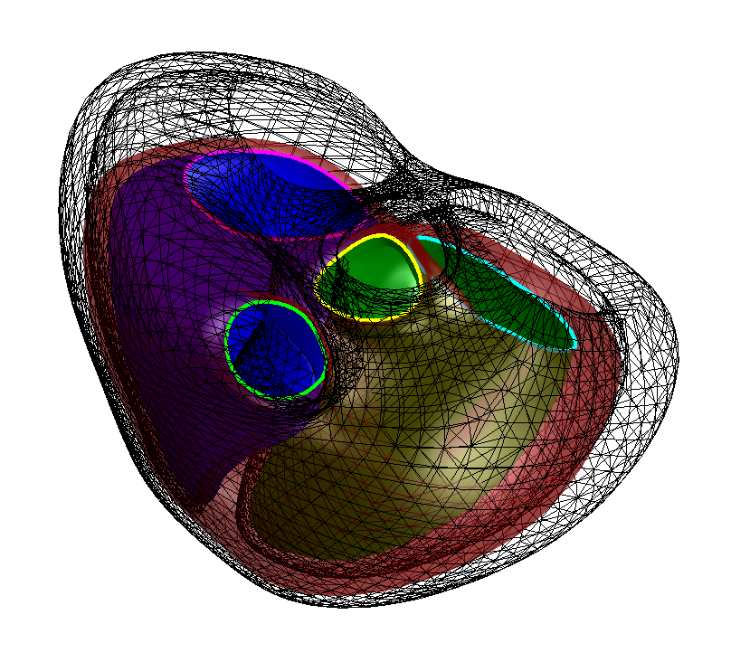
</p>

MATLAB tools to interact with a biventricular pediatric atlas created at end-diastole (ED) and end-systole (ES). 
The tools can be used to explore the atlas, visualize the atlas, and project new models onto it. 

<p align="right">(<a href="#readme-top">back to top</a>)</p>

<!-- GETTING STARTED -->
## Getting Started

To get a local copy up and running follow these simple steps.

### Installation

Clone the repo
 ```sh
 git clone https://github.com/cmrg-lab/Pediatric-Atlas.git
 ```

### Download relevant files

- Download the [height-corrected](https://drive.google.com/file/d/1Jq4gvQ0RuPUy7qi0Is6Ba3t1YRGC94Ct/view?usp=sharing) or [non height-corrected](https://drive.google.com/file/d/1KaxYgoRu6UC7m-WCibOWmHVtT7h8NW8m/view?usp=sharing) pediatric atlas through google drive.
- The atlases and additional matlab files used for some of the analysis in the scripts can also be found on the Zenodo attached to this repository. 
- For comparisons to an existing adult atlas, an [adult atlas](https://www.cardiacatlas.org/biventricular-modes/) can be downloaded from the [cardiac atlas website](https://www.cardiacatlas.org/).

<!-- LICENSE -->
<!--## License-->

<!--Distributed under the project_license. See `LICENSE.txt` for more information.-->

<!--<p align="right">(<a href="#readme-top">back to top</a>)</p>-->

## Atlas Description

This biventricular atlas was created from 93 healthy patients aged 10-21. Their hearts were modeled from cardiac magnetic resonance (CMR) images taken at ED and ES. This atlas was created using principal component analysis and can be used to statistically analyze pediatric, healthy morphology. Shown here are visualizations of the shape variance captured by the first 10 shape modes:

<table>
  <tr>
    <th>Modes</th>
    <th>Anterior View</th>
    <th>Basal View</th>
    <th>Posterior View</th>
  </tr>
  <tr>
    <td> 1 </td>
    <td>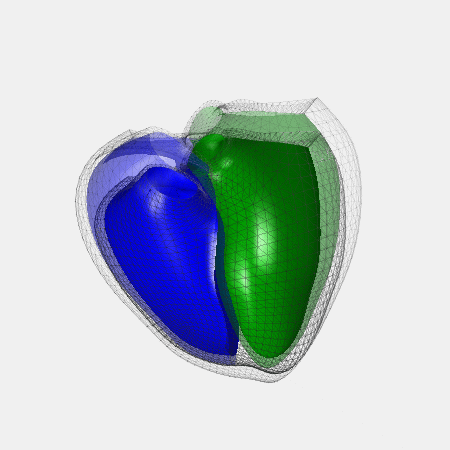</td>
    <td></td>
    <td></td>
   </tr> 
   <tr>
     <td> 2 </td>
     <td>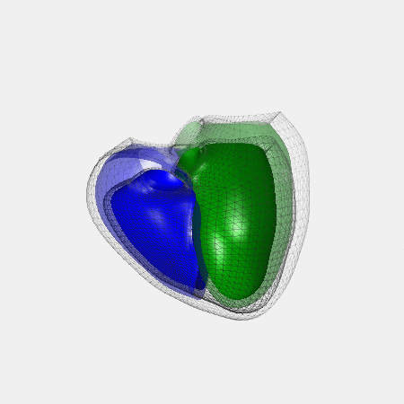</td>
     <td></td>
     <td></td>
  </tr>
  <tr>
     <td> 3 </td>
     <td></td>
     <td>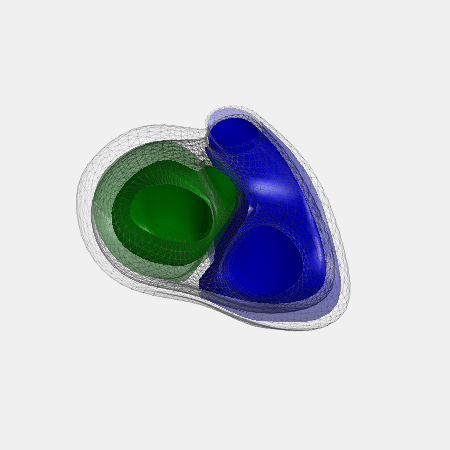</td>
     <td></td>
  </tr>
  <tr>
     <td> 4 </td>
     <td></td>
     <td>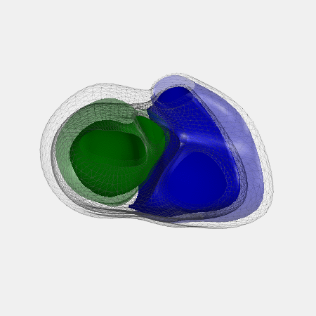</td>
     <td>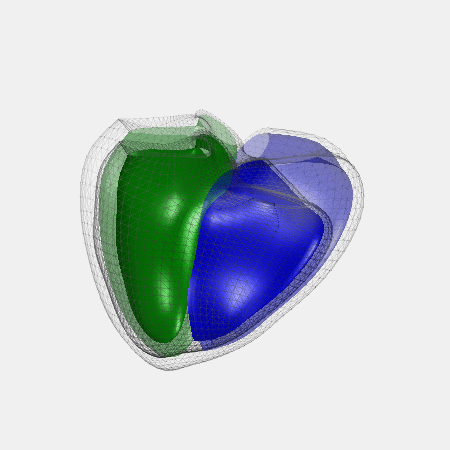</td>
  </tr>
  <tr>
     <td> 5 </td>
     <td>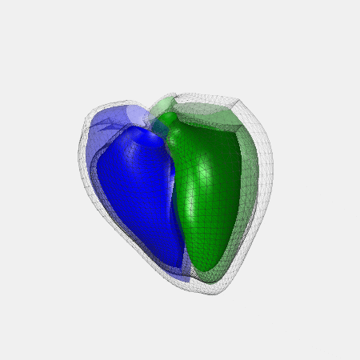</td>
     <td>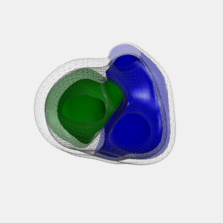</td>
     <td>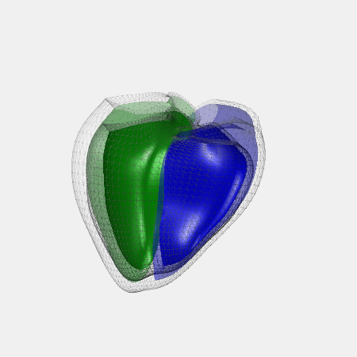</td>
  </tr>
  <tr>
     <td> 6 </td>
     <td>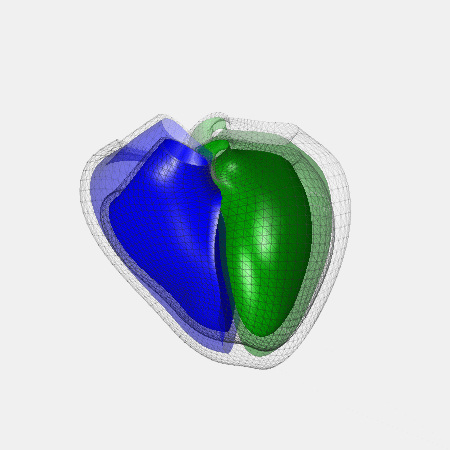</td>
     <td></td>
     <td>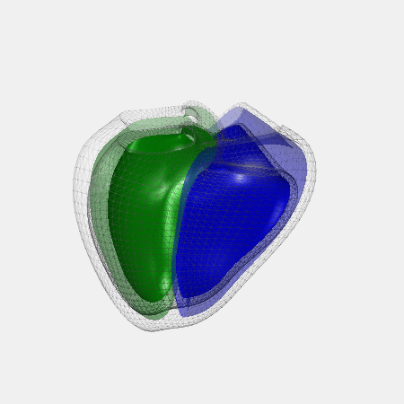</td>
  </tr>
  <tr>
     <td> 7 </td>
     <td></td>
     <td>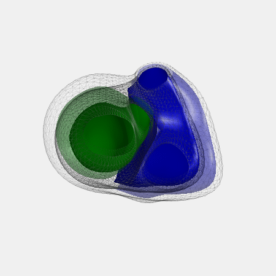</td>
     <td></td>
  </tr>
  <tr>
     <td> 8 </td>
     <td>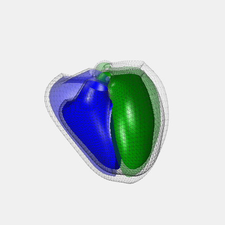</td>
     <td></td>
     <td></td>
  </tr>
  <tr>
     <td> 9 </td>
     <td></td>
     <td>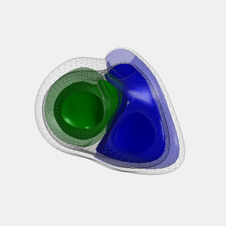</td>
     <td></td>
  </tr>
  <tr>
     <td> 10 </td>
     <td></td>
     <td>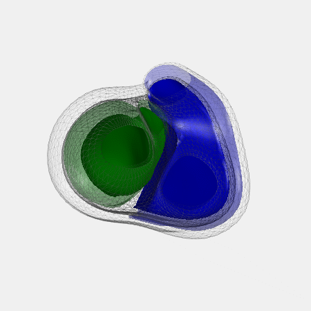</td>
     <td></td>
  </tr>
</table>

<p align="right">(<a href="#readme-top">back to top</a>)</p>

## Project Directory Structure

```bash
├── Data
│   └── MeshFiles
├── Images
│   ├── disease_comparison
│   └── pedatlas_characterization
├── Models
├── Scripts
│   ├── helpers
│   └── README.md
├── .gitignore
├── LICENSE
└── README.md
```

For more information on the scripts included in this repository, read the [README](./Scripts/README.md) in the Scripts folder. 

<!-- CONTACT -->
## Contact

Anna Qi - anqi@ucsd.edu

If you use the pediatric atlas or any of these tools in your research, please cite this paper:

> Qi, A. et al. (2025). A Pediatric Cardiac Shape Atlas: Insights into the Structure of Young Healthy Hearts. In: Chabiniok, R., Zou, Q., Hussain, T., Nguyen, H.H., Zaha, V.G., Gusseva, M. (eds) Functional Imaging and Modeling of the Heart. FIMH 2025. Lecture Notes in Computer Science, vol 15673. Springer, Cham. https://doi.org/10.1007/978-3-031-94562-5_14

<!-- ACKNOWLEDGMENTS -->
<!--## Acknowledgments-->

<!--* []()-->
<!--* []()-->
<!--* []()-->

<p align="right">(<a href="#readme-top">back to top</a>)</p>
