# Pediatric Cardiac Shape Atlas

<a href="https://doi.org/10.5281/zenodo.17554213"></a>

<p align="center">
 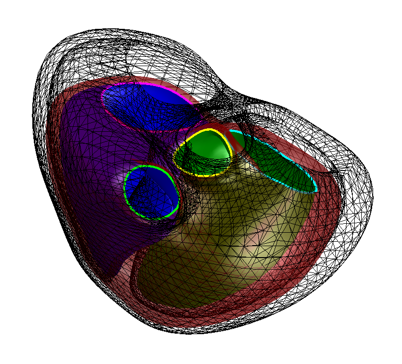
</p>

A set of MATLAB tools for interacting with a normative **biventricular pediatric cardiac shape atlas** built from 93 healthy patients aged 10-21. This atlas is constructed at both **end-diastole (ED)** and **end-systole (ES)** using principal component analysis (PCA) and can be used to:

- Explore and visualize the modes of shape variation in a healthy pediatric population
- Quantify how a new patient's cardiac morphology deviates from healthy pediatric norms
- Project patient models onto the atlas to obtain shape mode Z-scores
- Compare pediatric cardiac shape across disease populations (e.g., Tetralogy of Fallot)

Standard clinical metrics (volumes, ejection fractions, wall thickness) provide a limited view of cardiac geometry. This atlas captures global and regional variation in ventricular size, shape, and function in a single, quantative framework - offering a richer characterization of pediatric cardiac morphology than scalar indices alone. 

## Table of Contents
 
- [Atlas Description](#atlas-description)
- [Getting Started](#getting-started)
- [Usage](#usage)
- [Project Directory Structure](#project-directory-structure)
- [Data Access](#data-access)
- [Contact & Citation](#contact--citation)

## Atlas Description

The atlas was derived from **93 healthy pediatric patients** (ages 10–21; 62% male; mean age 15.4 ± 2.3 years) imaged at Rady Children's Hospital San Diego. CMR images were acquired at 1.5T using standard ECG-gated, breath-held SSFP cine sequences. Biventricular models were generated using an automated deep learning pipeline and refined by expert review.

The atlas was built using PCA on Procrustes-aligned, height-corrected biventricular surface meshes. **11 shape modes** together explain **83.1%** of total shape variance in the cohort. A non-height-corrected version is also provided for comparisons against atlases from other populations (e.g., adults).

**Cohort summary:**
 
| Characteristic | Value (n=93) |
|---|---|
| Age (years) | 15.4 ± 2.3 |
| Sex (male / female) | 62% / 38%  |
| Height (cm) | 166.2 ± 11.9 |
| Weight (kg) | 62.5 ± 17.5 |

The atlas has been validated against a cohort of 65 pediatric Tetralogy of Fallot (ToF) patients. ToF patients showed significant deviations from the healthy pediatric mean, particularly in modes associated with right ventricular dilation and sphericity. The pediatric atlas better characterized the ToF cohort than an adult reference (mean Mahalnobis distance 4.18 vs. 4.74, p < 0.001).

The shape variations captured by each of the first 11 modes of the height-corrected atlas are visualized below (± 3 standard deviations from the mean shape):

<table>
  <tr>
    <th>Modes</th>
    <th>Anterior View</th>
    <th>Basal View</th>
    <th>Posterior View</th>
  </tr>
  <tr>
    <td> 1 </td>
    <td></td>
    <td>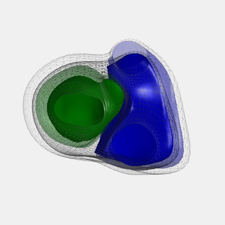</td>
    <td>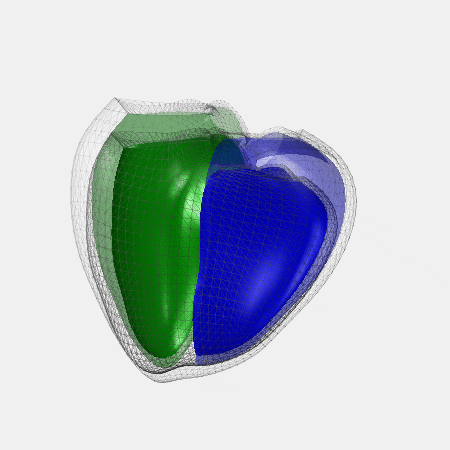</td>
   </tr> 
   <tr>
     <td> 2 </td>
     <td></td>
     <td>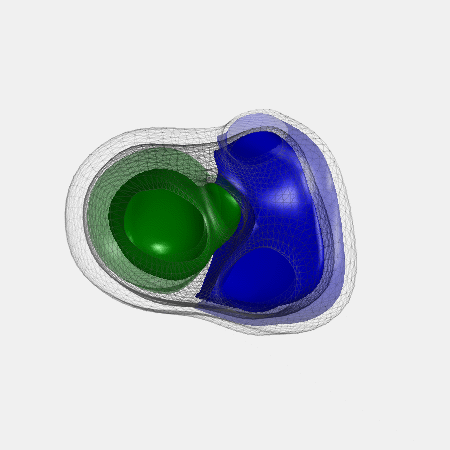</td>
     <td>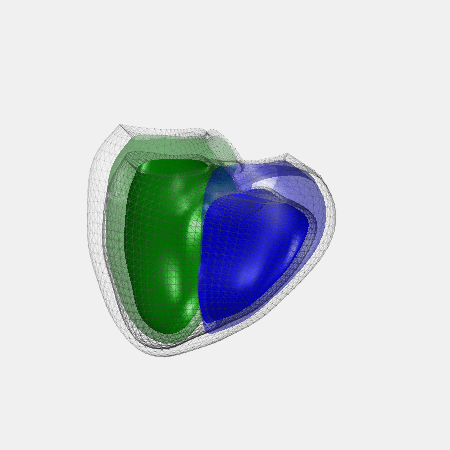</td>
  </tr>
  <tr>
     <td> 3 </td>
     <td></td>
     <td>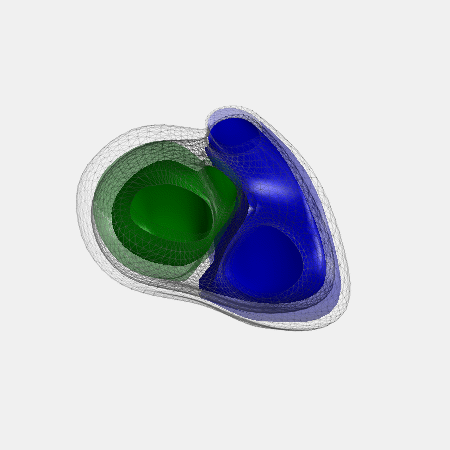</td>
     <td>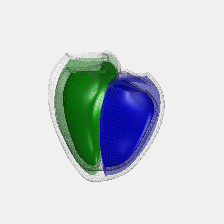</td>
  </tr>
  <tr>
     <td> 4 </td>
     <td></td>
     <td>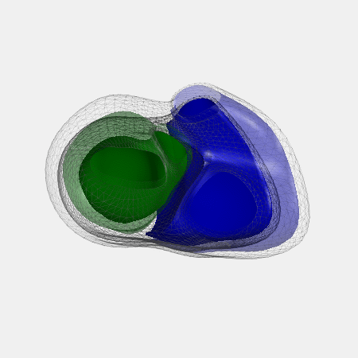</td>
     <td>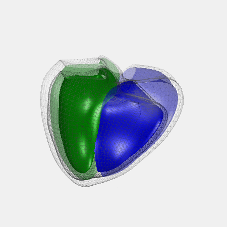</td>
  </tr>
  <tr>
     <td> 5 </td>
     <td></td>
     <td>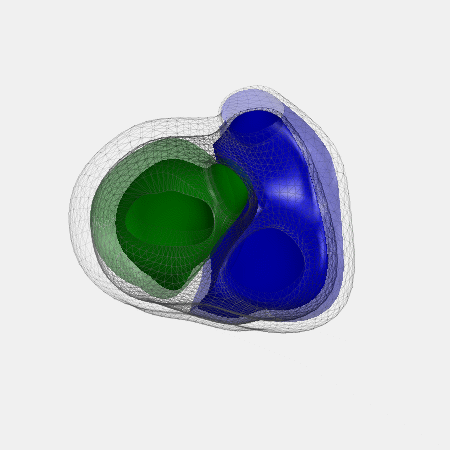</td>
     <td>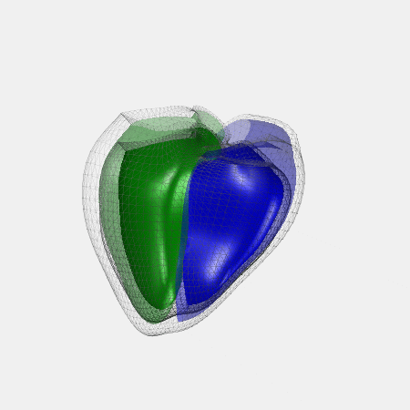</td>
  </tr>
  <tr>
     <td> 6 </td>
     <td></td>
     <td>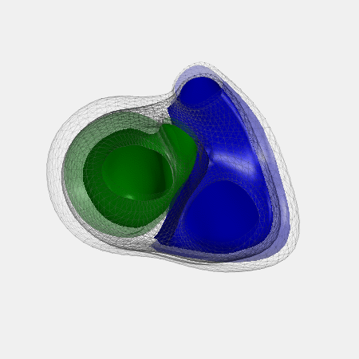</td>
     <td>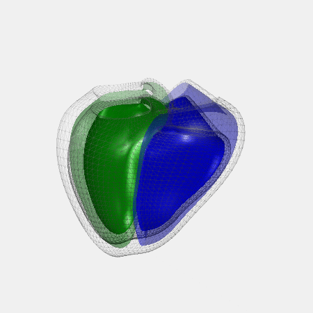</td>
  </tr>
  <tr>
     <td> 7 </td>
     <td></td>
     <td>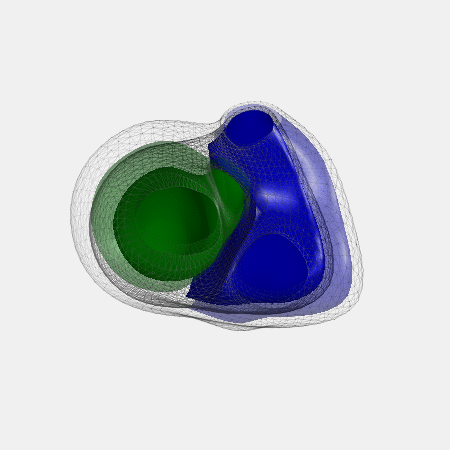</td>
     <td>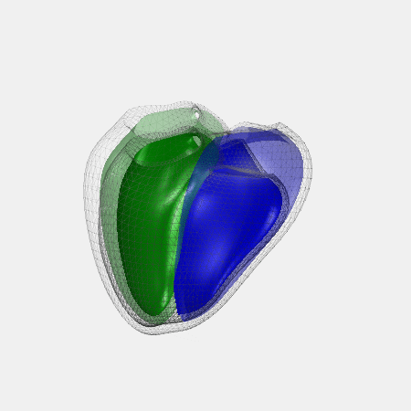</td>
  </tr>
  <tr>
     <td> 8 </td>
     <td></td>
     <td>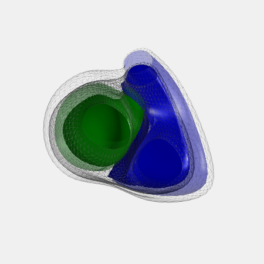</td>
     <td>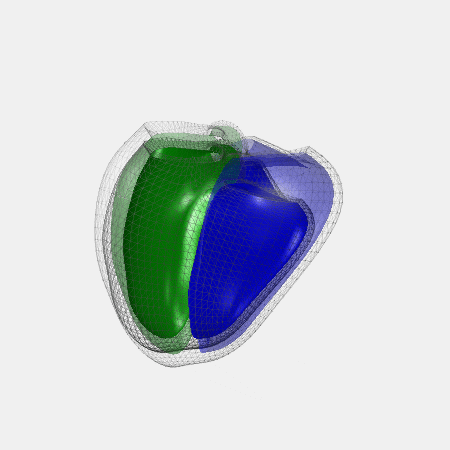</td>
  </tr>
  <tr>
     <td> 9 </td>
     <td></td>
     <td>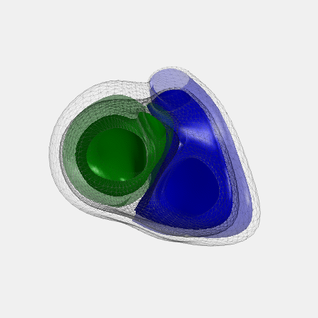</td>
     <td>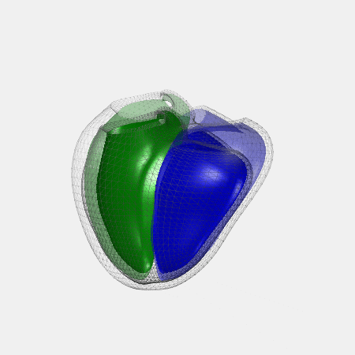</td>
  </tr>
  <tr>
     <td> 10 </td>
     <td></td>
     <td>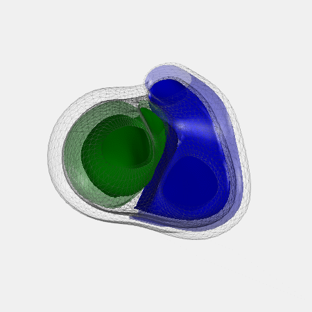</td>
     <td>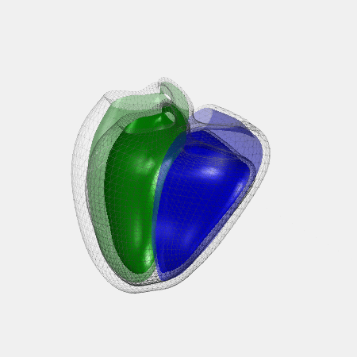</td>
  </tr>
  <tr>
     <td> 11 </td>
     <td></td>
     <td></td>
     <td></td>
  </tr>
</table>

<p align="right">(<a href="#pediatric-cardiac-shape-atlas">back to top</a>)</p>

## Getting Started

Prerequisites

- MATLAB R2021a or later (tested on R2025a)
- The Statistica and Machine Learning Toolbox is needed for some analyses

### Installation

Clone the repository:
 ```bash
 git clone https://github.com/cmrg-lab/Pediatric-Atlas.git
cd Pediatric-Atlas
 ```

### Download relevant files

The atlas `.mat` files are not included in the repository due to file size. Download them from one of two sources:

- Google Drive: [Height-corrected atlas](https://drive.google.com/file/d/1Jq4gvQ0RuPUy7qi0Is6Ba3t1YRGC94Ct/view?usp=sharing) and the [Non-height-corrected atlas](https://drive.google.com/file/d/1KaxYgoRu6UC7m-WCibOWmHVtT7h8NW8m/view?usp=sharing).
- Zenodo: both atlas files and additional MATLAB files needed for some of the scripts are archived at the [Zenodo repository](https://doi.org/10.5281/zenodo.17554213) linked to this project. 

Place the downloaded `.mat` files into the `Data/` directory before running scripts.

**For adult atlas comparisons:** A biventricular adult reference atlas (derived from the UK Biobank) can be downloaded from the [Cardiac Atlas Project website](https://www.cardiacatlas.org/biventricular-modes/).

<p align="right">(<a href="#pediatric-cardiac-shape-atlas">back to top</a>)</p>

## Usage

Full documentation for all scripts is in `[Scripts/README.md](./Scripts/README.md)`. The core workflows are:

**1. Atlas Creation**

To create a new atlas, 3D model files must first be added in a `Models/` folder. The path in `extractPoints.m` should also be updated. To extract, align and create the atlas using the PCA points, use these three scripts. 

```matlab
% From the Scripts/directory:
run('extractPoints.m')
run('alignPoints.m')
run('genAtlas.m')
```

**2. Explore and visualize the atlas**

Loads the atlas and visualizes the mean shape and shape mode variations at ED and ES. Plots the variance explained by the shape modes in the atlas. Derives z-scores for individuals used to generate the atlas. Analyze correlations between atlas shape modes and clinical metrics. Cohorts within the atlas separated by sex or bmi can also be compared mode-wise.

```matlab
run('atlasViewer.m')
run('plotVarianceExplained.m')
run('genZScores.m')
run('analyzeCorrelations.m')
run('compareCohorts.m')
```

**3. Project a new model onto the atlas**

Provide your own biventricular model as an input (an example one is included in `Models/`). This function will return per-mode Z-scores indicating morphological deviation from the healthy pediatric mean.

```matlab
run('projectOntoAtlas.m')
```

**4. Compare populations**

Compares the shape mode distributions of cohorts within the atlas. Computes Mahalanobis distances and mode-wise Z-scores distributions across separate cohorts. 

```matlab
run('distanceAnalysis.m')
```

<p align="right">(<a href="#pediatric-cardiac-shape-atlas">back to top</a>)</p>

## Project Directory Structure

```bash
├── Data/
│   └── MeshFiles
├── Images/
│   ├── disease_comparison
│   └── pedatlas_characterization
├── Models/
├── Scripts/
│   ├── helpers
│   └── README.md
├── .gitignore
├── LICENSE
└── README.md
```

<p align="right">(<a href="#pediatric-cardiac-shape-atlas">back to top</a>)</p>

## Data Access

**Individual patient data** (CMR images, clinical data, point clouds) can be made available through the <a href="https://capchd.ucsd.edu/#/">Cardiac Atlas Project</a> subject to a Data Use Agreement. The CAP IDs for both the pediatric healthy and diseased participants used to in this work are listed on the <a href="https://capchd.ucsd.edu/#/pediatric">Pediatric Atlas page</a> for registered users. 

## Contact & Citation

Anna Qi - anqi@ucsd.edu

If you use the pediatric atlas or these tools in your research, please cite:

> Qi, A. et al. (2025). A Pediatric Cardiac Shape Atlas: Insights into the Structure of Young Healthy Hearts. In: Chabiniok, R., Zou, Q., Hussain, T., Nguyen, H.H., Zaha, V.G., Gusseva, M. (eds) Functional Imaging and Modeling of the Heart. FIMH 2025. Lecture Notes in Computer Science, vol 15673. Springer, Cham. https://doi.org/10.1007/978-3-031-94562-5_14

A follow-up manuscript with an expanded cohort (n=93) and Tetralogy of Fallot validation is under review. Please check back for an updated citation.

## License
 
Distributed under the Apache 2.0 License. See [`LICENSE`](LICENSE) for details.

<p align="right">(<a href="#pediatric-cardiac-shape-atlas">back to top</a>)</p>
