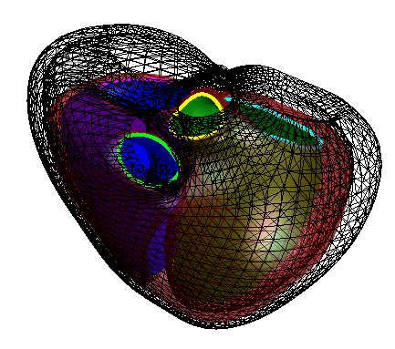

# A Pediatric Atlas

<!-- ABOUT THE PROJECT -->
## About The Project



MATLAB tools to interact with a biventricular atlas created at end-diastole (ED) and end-systole (ES). 
The tools can be used to explore the atlas, visualize the atlas, and project new patients onto it. 

<p align="right">(<a href="#readme-top">back to top</a>)</p>

<!-- GETTING STARTED -->
## Getting Started

To get a local copy up and running follow these simple example steps.

### Installation

Clone the repo
 ```sh
 git clone https://github.com/cmrg-lab/Pediatric-Atlas.git
 ```

### Download relevant files

- Download the [pediatric atlas](https://drive.google.com/file/d/1bxyJrpj4AOvLQyZHaM6Xs3uAcwkg6w0a/view?usp=sharing) through google drive.
- If you want to use 'projectOntoAtlas.m' to compare model files to an existing adult atlas, download the [adult atlas](https://www.cardiacatlas.org/biventricular-modes/) from the [cardiac atlas website](https://www.cardiacatlas.org/).

<!-- LICENSE -->
<!--## License-->

<!--Distributed under the project_license. See `LICENSE.txt` for more information.-->

<!--<p align="right">(<a href="#readme-top">back to top</a>)</p>-->

## Atlas Description

This pediatric biventricular atlas was created from 50 patients aged 11-18. Their hearts were modeled from cardiac magnetic resonance (CMR) images taken at ED and ES. This atlas was created using principal component analysis and can be used to statistically analyze pediatric shapes. Shown here are visualizations of the shape and functional variance captured by each of the first 10 shape modes:

<table>
  <tr>
    <th>Modes</th>
    <th>Anterior View</th>
    <th>Basal View</th>
    <th>Posterior View</th>
  </tr>
  <tr>
    <td> 1 </td>
    <td></td>
    <td></td>
    <td></td>
   </tr> 
   <tr>
     <td> 2 </td>
     <td></td>
     <td></td>
     <td></td>
  </tr>
  <tr>
     <td> 3 </td>
     <td></td>
     <td></td>
     <td></td>
  </tr>
  <tr>
     <td> 4 </td>
     <td></td>
     <td></td>
     <td></td>
  </tr>
  <tr>
     <td> 5 </td>
     <td></td>
     <td></td>
     <td></td>
  </tr>
  <tr>
     <td> 6 </td>
     <td></td>
     <td></td>
     <td></td>
  </tr>
  <tr>
     <td> 7 </td>
     <td></td>
     <td></td>
     <td></td>
  </tr>
  <tr>
     <td> 8 </td>
     <td></td>
     <td></td>
     <td></td>
  </tr>
  <tr>
     <td> 9 </td>
     <td></td>
     <td></td>
     <td></td>
  </tr>
  <tr>
     <td> 10 </td>
     <td></td>
     <td></td>
     <td></td>
  </tr>
</table>

<p align="right">(<a href="#readme-top">back to top</a>)</p>

## File Descriptions

- `analysisCorrelation.m` is an example file of how correlation matrices with certain functional metrics can be generated. 
This file currently cannot be ran because individual-level data such as blood pressures, ages, heights, etc. will not be publicly available.
Feel free to replace 'MastersFile.xlsx' with your own data descriptors.
- `atlasViewer.m` allows you to visualize each mode of the atlas as well as the mean shape. You can change the parameters to which modes and adjusted
scores you want to visualize.
- `genEDESModels.m` is how a 3D shape can be generated using individual PC-scores and the atlas. A set of PC scores are turned into a mesh that is used for visualization.
- `genZScores.m` will extract PC shape scores. Every patient will have shape scores related to each PC mode.
- `makeModeMovies.m` will create gifs of how each PC changes across its score distribution.
- `plotSurface.m` is used to visualize mesh surfaces.
- `plotValves.m` is used to visualize mesh valves.
- `plotVarianceExplained.m` will create a graph showing the variance explained by each shape mode in the atlas.
- `plotWireframe.m` is used to visualize a biventricular mesh in a wireframe format where there is no color but the nodes are connected by black lines.
- `projectOntoAtlas.m` will generate shape mode scores for some patients by using points described in a mesh format. 
These patients are projected onto an existing atlas. You can download [unalignedPts.mat](https://drive.google.com/file/d/1GgcEWqYsxgcv0S49EO_lRXdQQtgtK8y0/view?usp=sharing) to try out the code. 

<!-- CONTACT -->
## Contact

Anna Qi - anqi@ucsd.edu

If you use the pediatric atlas or any of these tools in your research, please cite the following citation!

> Qi A, Kim C, Young N, Yu X, Crabb BT, Schuchardt EL, Hegde S, Mauger C, Young AA, Omens JH, McCulloch AD, Narayan HK. A Pediatric Cardiac Shape Atlas: Insights into the Structure of Young Healthy Hearts. In: Functional Imaging and Modeling of the Heart (FIMH) 2025. (in press)

<!-- ACKNOWLEDGMENTS -->
<!--## Acknowledgments-->

<!--* []()-->
<!--* []()-->
<!--* []()-->

<p align="right">(<a href="#readme-top">back to top</a>)</p>
